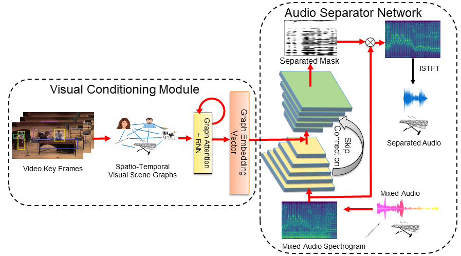

<!--
Copyright (C) 2021, 2023 Mitsubishi Electric Research Laboratories (MERL)

SPDX-License-Identifier: AGPL-3.0-or-later
-->

# Visual Scene Graphs for Audio Source Separation

## Overview

Code repository for ["Visual Scene Graphs for Audio Source Separation"](http://openaccess.thecvf.com/content/ICCV2021/papers/Chatterjee_Visual_Scene_Graphs_for_Audio_Source_Separation_ICCV_2021_paper.pdf), ICCV 2021.

[[Video]](https://www.youtube.com/watch?v=0GqRjiH4urE)

<br/>



<br/>

Associating the visual appearance of real world objects with their auditory signatures is critical for holistic AI systems and finds practical usage in several tasks, such as audio denoising, musical instrument equalization, etc.

In this work, we consider the task of visually guided audio source separation. Towards this end, we propose a deep neural network, called Audio Visual Scene Graph Segmenter (AVSGS), with the following two components:

 * Visual Conditioining Module
 * Audio-Separator Network

As illustrated in the figure above, AVSGS begins by leveraging its Visual Conditioning module to create dynamic graph embeddings of potential auditory sources and their context nodes. Towards this end, this module employs Graph Ateention Networks and Edge Convolution. Next, the graph embeddings are used to condition a U-Net style network, called the Audio Separator Network, which is responsible for undertaking the audio source separation.

## Installation

Please refer to `requirements.txt` file.
```
pip install -r requirements.txt
```

## Datasets

In the paper, we report experimental results on two datasets, viz. MUSIC, and Audio Separation in the Wild (ASIW). Here we provide the instructions for preparing the ASIW dataset.
Please download the pre-processed dataset from this [link](https://docs.google.com/forms/d/e/1FAIpQLScmU7xOqqMIERe2NLGNasyfsXnIYyev_CIXLVe5XzPn3BkmkQ/viewform).

Then, unzip it into the root directory where this repository is cloned.

## Training

In this repo, we provide the code for training and evaluating AVSGS on the ASIW dataset.  In order to train, please run:

```
$ cd final_audiocaps_graphcomb_context
$ python train_noaug_noclassif.py --name audiocaps_noclassif_multilab --data_path ../../Audiocaps_Dataset/ --hdf5_path ../../audiocaps/dataset/ --scene_path ./pre_trained/ADE.h5 --gpu_ids 0 --batchSize 25 --nThreads 10 --display_freq 10 --save_latest_freq 1000 --niter 1 --validation_freq 400 --validation_batches 20 --num_batch 50000 --lr_steps 15000 30000 --classifier_loss_weight 0.05 --coseparation_loss 1 --unet_num_layers 7 --lr_visual 0.00001 --lr_unet 0.0001 --lr_classifier 0.0001 --weighted_loss --visual_pool conv1x1 --optimizer adam --log_freq True --with_additional_scene_image |& tee -a ./log_audiocaps_multilab.txt
```

Training on the MUSIC dataset maybe performed similarly by appropriately changing the dataloader.

## Evaluation

Post the training, the evaluation for a pair of videos may be performed by running the following command:

```
$ cd final_audiocaps_graphcomb_context
$ python test_noaug_eval.py --video1_name Z3wDry8nnJs --video2_name rBUCIK8JRLg --visual_pool conv1x1 --unet_num_layers 7 --data_path ../../Audiocaps_Dataset/ --hdf5_path ../../audiocaps/dataset/ --gpu_ids 0 --weights_unet ./checkpoints/xxx/unet_best.pth --weights_classifier ./checkpoints/xxx/classifier_best.pth --weights_graph ./checkpoints/xxx/graph_net_best.pth --weights_map_net ./checkpoints/xxx/map_net_best.pth --weights_rnn ./checkpoints/xxx/rnn_best.pth --num_of_object_detections_to_use 1 --with_additional_scene_image --scene_path ./pre_trained/ADE.h5 --output_dir_root ./test_results/
```

## Citation

If you use the software or find the paper useful, please cite the following:

```BibTeX
@inproceedings{chatterjee2021visual,
    author = {Chatterjee, Moitreya and Le Roux, Jonathan and Ahuja, Narendra and Cherian, Anoop},
    title = {Visual Scene Graphs for Audio Source Separation},
    booktitle = {Proceedings of the IEEE/CVF International Conference on Computer Vision},
    year = {2021},
    pages = {1204--1213},
    publisher = {IEEE Computer Society},
}
```

## Contact

For any queries, questions about our work or this code repository, please email: Moitreya Chatterjee (chatterjee@merl.com)

## Contributing

See [CONTRIBUTING.md](CONTRIBUTING.md) for our policy on contributions.

## License

Released under `AGPL-3.0-or-later` license, as found in the [LICENSE.md](LICENSE.md) file. Parts of this code repository
have been adapted from https://github.com/rhgao/co-separation (`CC-BY-4.0` license, see: [LICENSES/CC-BY-4.0.md](LICENSES/CC-BY-4.0.md)).

All files, except as listed below:

```
Copyright (C) 2021, 2023 Mitsubishi Electric Research Laboratories (MERL).

SPDX-License-Identifier: AGPL-3.0-or-later
```

Files in `final_audiocaps_graphcomb_context/`

```
Copyright (C) 2021, 2023 Mitsubishi Electric Research Laboratories (MERL).
Copyright (C) 2019 Ruohan Gao

SPDX-License-Identifier: AGPL-3.0-or-later
SPDX-License-Identifier: CC-BY-4.0
```
